# Deploying-sprint-boot-k8s

## Deploying Spring Boot application on Kubernetes

## Create ec2 instance t2medium/t3medium
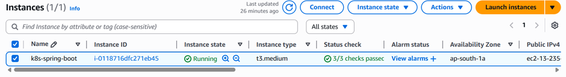
 

## Install Docker on the Instance
### Docker is required because Minikube will use Docker as the container runtime
 
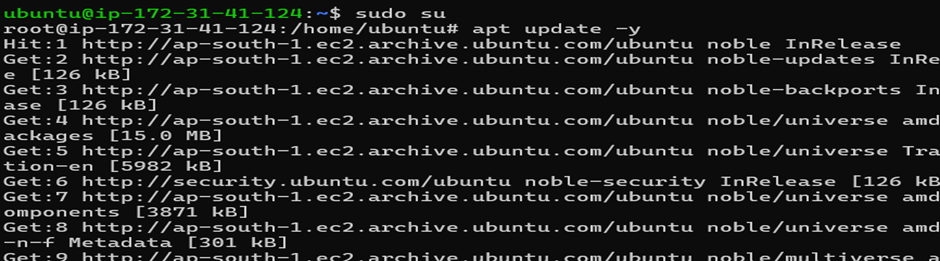  

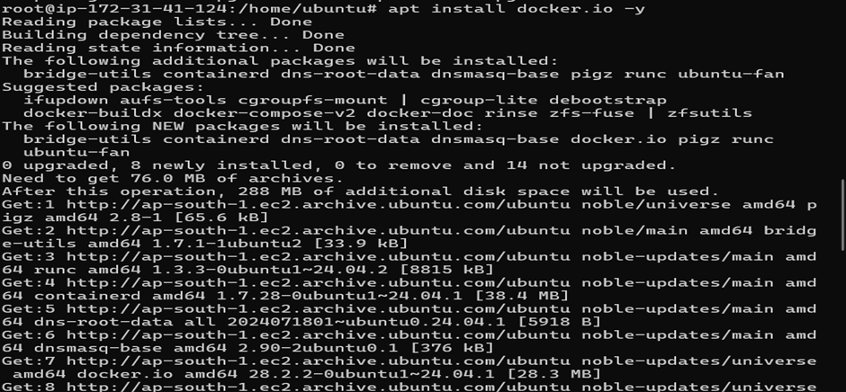

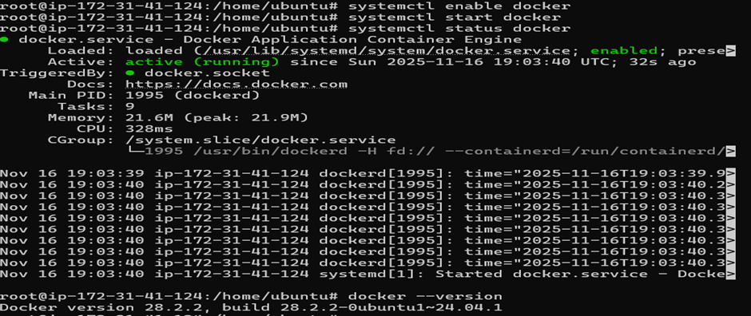

## Conntrack helps Kubernetes manage the state of network connections between applications


## Install and Start Minikube
### Minikube creates a local Kubernetes cluster inside your EC2 VM.


## Install kubectl (Kubernetes CLI)
### kubectl is used to interact with Kubernetes cluster resources.
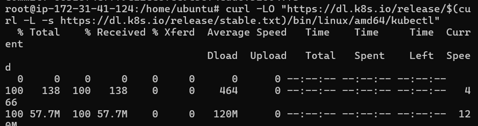

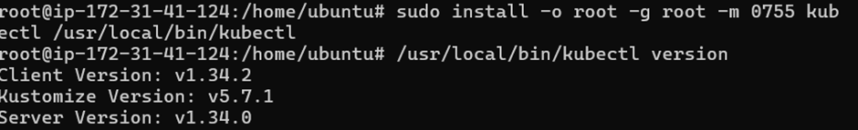

## Install Git & Clone Repository
### Git is used to download the Spring Boot + K8s project
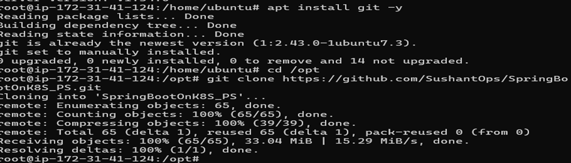

## Deploy MySQL Database on Kubernetes
### Creates MySQL deployment + persistent volume claim + service.


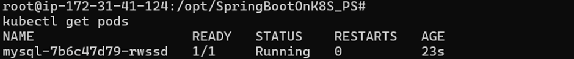

## Enter inside MySQL pod
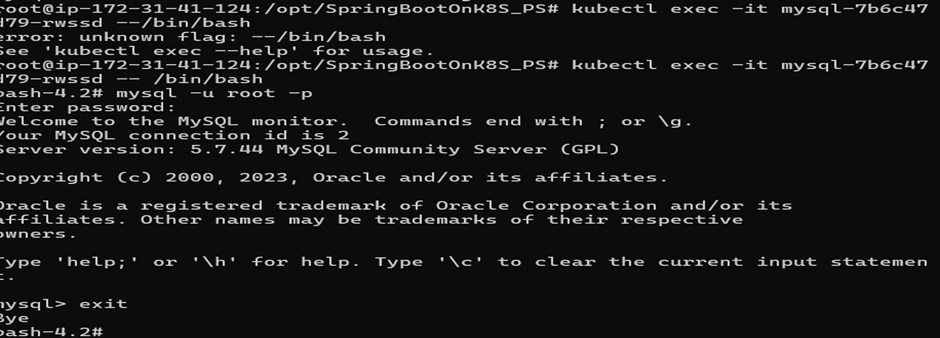

## Install Maven
### Maven builds Spring Boot jar application. 


## Build Docker Image
### Create application Docker image using Dockerfile
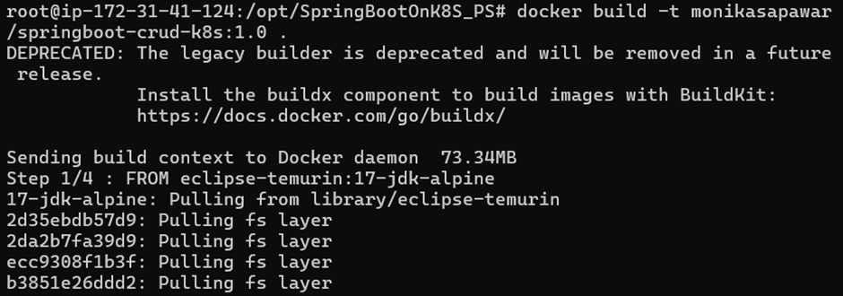

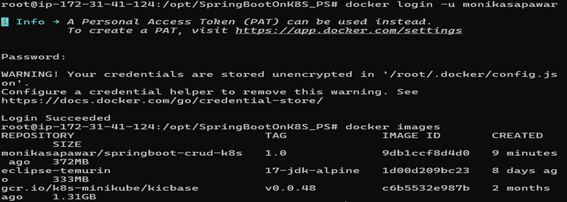
 
## Push Image to DockerHub


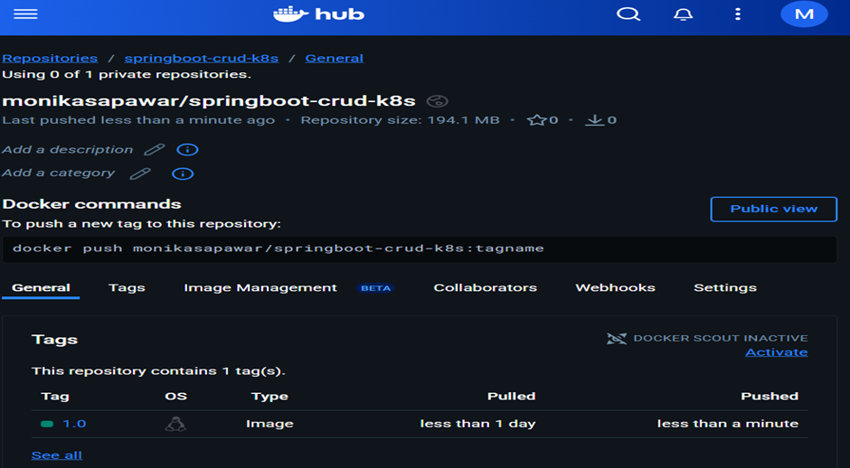
 
## Deploy Spring Boot App on Kubernetes
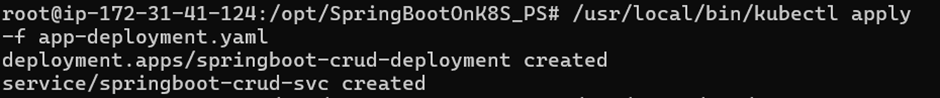 


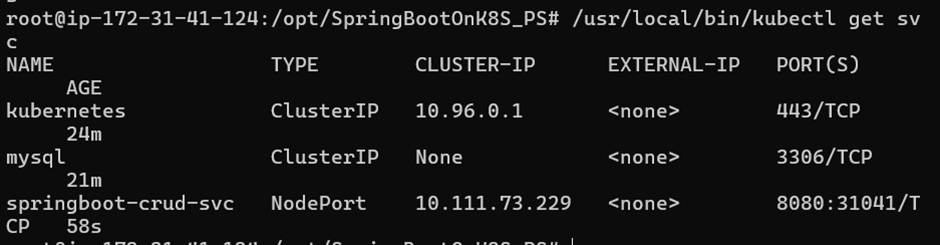

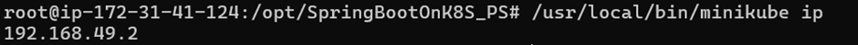

## Access Application using Port Forwarding
### Port forwarding exposes internal K8s service to external host.
 
Open Kubernetes Dashboard
Start proxy to expose dashboard outside localhost
 


## Kubernetes Dashboard using Public IP
```
http://13.235.115.61:8001/api/v1/namespaces/kubernetes-dashboard/services/http:kubernetes-dashboard:/proxy/#/replicaset?namespace=default
 
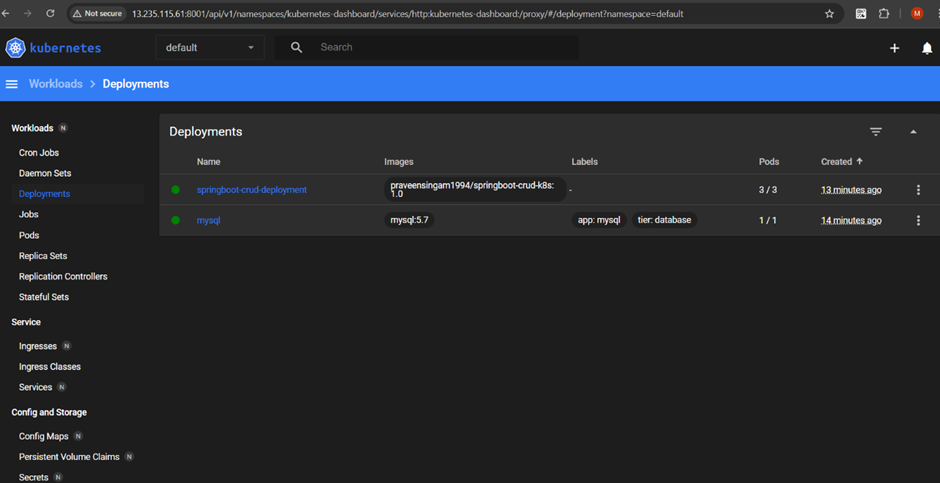


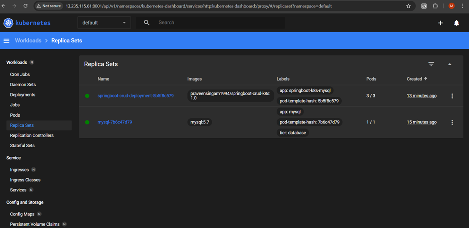


